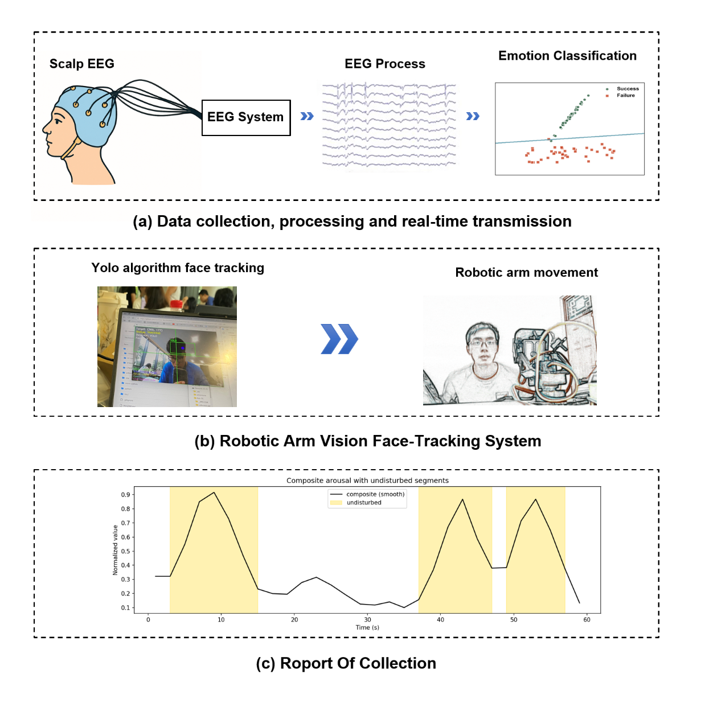
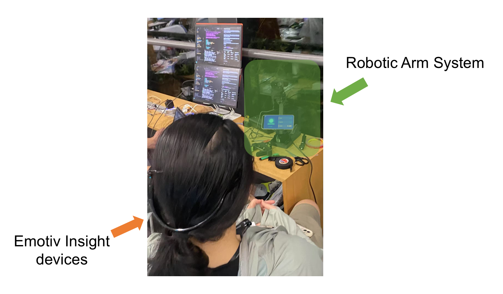
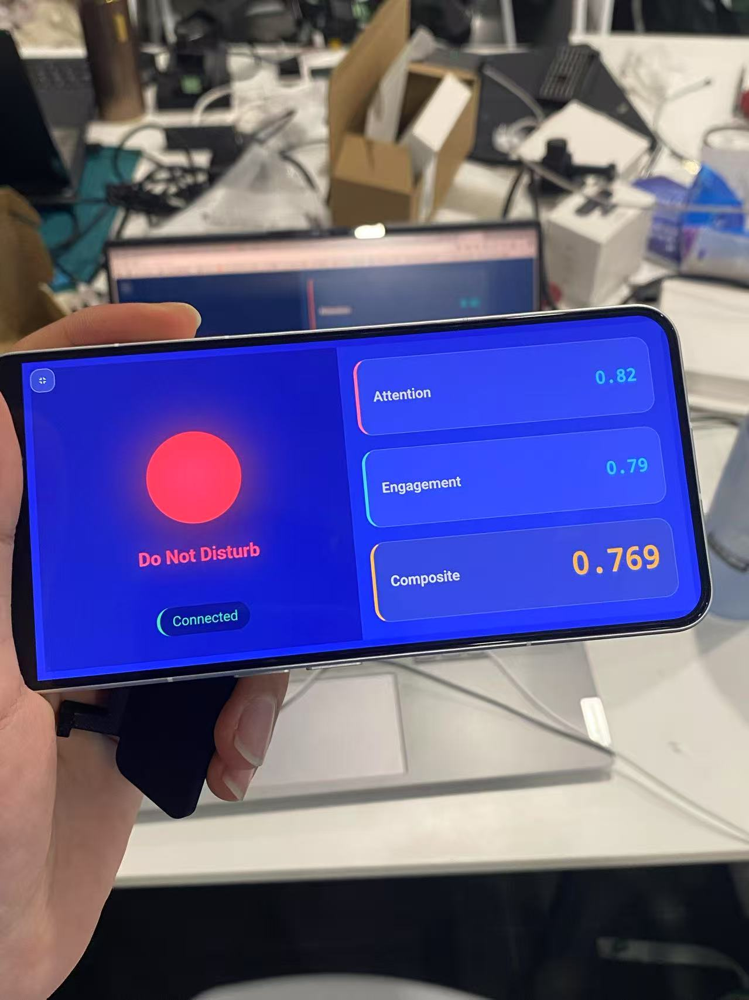

# EEG-Based Real-time Attention Monitoring and Robotic Disturbance Detection System

## Abstract

This system utilizes Emotiv Insight BCI devices to collect users' EEG signals over 240 seconds, extracting six emotional dimensions in real-time and determining through algorithmic analysis whether users are in a state where they prefer not to be disturbed. The robotic arm system is specifically designed for 4-minute continuous monitoring scenarios, providing real-time prompts to external personnel to prevent interruption of focused states.

## System Architecture

### EEG Signal Acquisition and Classification Processing

#### Real-time User Signal Extraction
Through Emotiv software, the system converts raw EEG signals from users into six emotional signals: attention, relaxation, engagement, excitement, stress, and interest.

#### Signal Classification
The weight distribution is based on cognitive psychology research:

- **Attention (35%)**: Core indicator reflecting user focus level
- **Engagement (25%)**: Measures user task involvement level
- **Excitement, Interest, Stress (15% each)**: Auxiliary indicators for overall state adjustment
- **Relaxation (-10%)**: Negative weight reflecting inverse relationship with attention

**Data Normalization**: Standardizes comprehensive emotional indicators to 0-1 range
**Signal Smoothing**: Employs 3-point moving average filtering to reduce noise interference
**Peak Detection**: Uses scipy.signal.find_peaks to identify emotional peaks
**Gradient Analysis**: Utilizes numpy.gradient for precise identification of rising start points and falling end points

The system outputs a comprehensive score. When the score exceeds 0.44, the state is classified as "do not disturb"; otherwise, it is classified as "available for interaction."

### EEG Data Processing

The system collects six key cognitive indicators through the Emotiv headset: Attention, Engagement, Excitement, Interest, Stress, and Relaxation. These raw data undergo real-time processing and standardization to form a reliable foundation for cognitive state assessment.

### Intelligent Algorithm Analysis

The system employs weighted comprehensive algorithms for multi-dimensional cognitive indicator fusion analysis. Different weights are assigned to each indicator (attention has the highest weight of 0.35, relaxation has negative weight of -0.10), calculating comprehensive arousal scores through mathematical models. When scores exceed the 0.44 threshold, the state is classified as focused; otherwise, it is classified as distracted. Analysis frequency is set to once every 2 seconds to ensure real-time performance and accuracy.

## Robotic Arm Visual Face Tracking System

The mechanical tracking system employs two SEED bus servo motors to construct horizontal and vertical dual-degree-of-freedom pan-tilt mechanisms, achieving precise angle control and real-time response through Python SDK. Horizontal axis servo motor 0 handles left-right tracking with ±90-degree control range, while vertical axis servo motor 4 handles up-down tracking with ±60-degree control range. Two-axis coordination enables comprehensive face following.

The system employs PID control algorithms, calculating servo rotation angles based on target offset provided by the vision module to achieve smooth, stable tracking motion. Bus communication protocol ensures real-time transmission of control commands, with servo response delay under 20 milliseconds and tracking precision reaching ±1 degree.

### Face Recognition Algorithm

The system employs YOLOv8n deep learning model as the core detection engine, simultaneously predicting multiple target positions and categories through single forward propagation. Since YOLO natively detects "person" category rather than specialized faces, the algorithm innovatively adopts human anatomical estimation strategy: first detecting complete human body bounding boxes, then intelligently calculating face positions based on anatomical rules that faces typically occupy the upper 1/4 region of the human body with width approximately half of shoulder width.

The system sets 0.5 confidence threshold to filter low-quality detections, excludes noise through 30x30 pixel minimum size screening, and automatically selects the largest area face for tracking when multiple targets are detected, ensuring detection accuracy and stability.

To address target loss and position jitter in real-time detection, the system implements innovative "2-second intelligent locking" tracking algorithm. When detection algorithms temporarily lose targets, the tracker locks the last known position for 2 seconds, effectively avoiding target jumping due to lighting changes, facial occlusion, or algorithm fluctuations.

## Frontend Interface Design

The frontend interface adopts modern Apple-style design, supporting perfect adaptation for desktop and mobile devices. The interface is divided into left and right regions: the left side features dynamic status indicators displaying current focus states through red-green circular indicators and pulse animations; the right side presents real-time data panels showing attention, engagement, and comprehensive score value changes in card format.

The system is specifically optimized for mobile landscape usage scenarios, providing fullscreen functionality buttons and supporting immersive experiences. CSS media query technology achieves adaptive layouts for different screen sizes, ensuring optimal user experience across various devices. Fullscreen functionality is compatible with mainstream browser fullscreen APIs, including Chrome, Safari, and Firefox.

WebSocket technology enables real-time frontend-backend communication with data transmission delay controlled within 100 milliseconds. The frontend ensures connection stability through automatic reconnection mechanisms while supporting cross-network access - mobile phones and computers connected to the same hotspot can achieve remote monitoring.

### Focus State Analysis Charts

The system automatically generates dual-layer analysis charts: the upper layer presents focus state timeline bar charts using red-green bars to intuitively display focus states at each time point, with semi-transparent green rectangles marking continuous focus periods; the lower layer shows comprehensive score change curve charts displaying score fluctuation trends over time, including focus threshold lines and filled areas.

The system provides detailed focus state statistical reports including total duration, focus duration, focus ratio, and focus interval count among key indicators. All raw data is saved in CSV format for subsequent in-depth analysis and research. Charts are output in high-resolution PNG format, supporting academic and commercial applications.

## Technical Specifications

- **EEG Sampling Rate**: 128 Hz per channel
- **Processing Frequency**: 2-second intervals for state classification
- **Tracking Accuracy**: ±1 degree precision
- **System Response Time**: <100ms for real-time feedback
- **Face Detection Performance**: 25-30 FPS processing speed
- **Communication Protocol**: WebSocket for real-time data transmission

## Applications

This system demonstrates significant potential in assistive technology, educational platforms, and human-machine collaboration scenarios. The modular architecture ensures scalability and adaptability across different deployment environments while maintaining high accuracy and real-time performance.

## Conclusion

This project successfully implements a comprehensive BCI system integrating emotion recognition, visual servo control, and adaptive robotic technology for attention state monitoring. The integration of multiple sensing modalities, complex signal processing algorithms, and adaptive control strategies establishes a new paradigm for cognitive-aware robotic systems. Future research will focus on personalization enhancement and multi-modal sensor fusion to improve classification robustness.